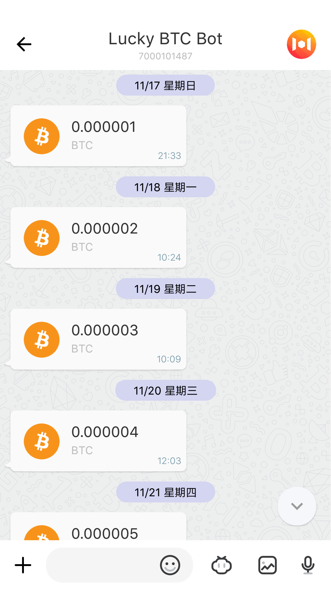
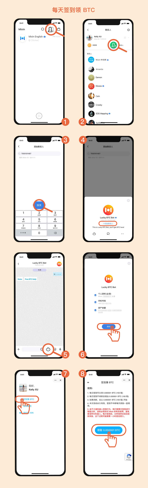
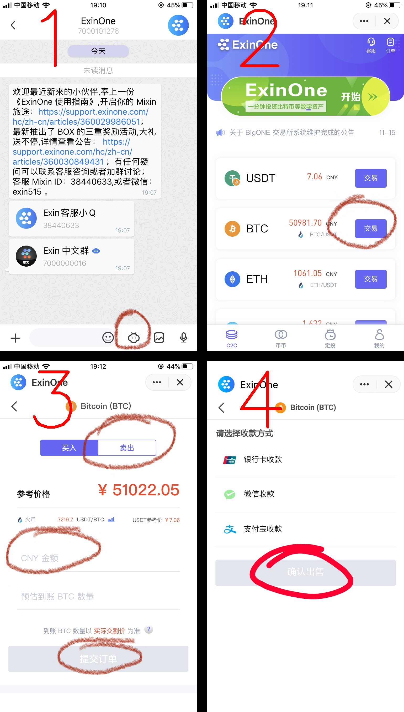

> 不要对短期期望过高，而对长期期望过低。
>
> 长期是最具魔力的一个概念，如果你能与长期做朋友，那么他一定会给你带来神奇的变化。

# Mixin签到奖励——40年500万

## Mixin签到说明

### 事实：

[Mixin Messenger](https://mixin.one/messenger)目前在自己平台上开启了一个签到奖励的活动，活动规则如下：

* 每日签到（北京时间早8点到次日8点）可以领取0.000001BTC(即100聪比特币)。
* 每日签到不间断会增加0.000001BTC。
* 如果间断，会从0.000001BTC重新开始。
* 本次活动永久有效，签到不中断每天奖励一直增加。

### 收益分析：

#### 1、短期收益很少 

每日签到赠送100聪比特币，按照现在的比特币价格计算相当于人民币0.05元，也就是5分钱，是不是感觉很少，想要对这个签到奖励嗤之以鼻？先别这么着急下判断，请耐心继续往下看，结论会震惊到你的。

#### 2、长期收益很惊人

** 关键在于第二条规则：** 奖励的 BTC 会根据连续签到的天数增加，每连续签到一天，当天奖励增加 0.000001 BTC。举个例子：

| 连续签到天数 | 获得的 BTC 数量 |
| ------------ | --------------- |
| 第 1 天      | 0.000001 BTC    |
| 第 2 天      | 0.000002 BTC    |
| 第 3 天      | 0.000003 BTC    |
| ...          | ...             |
| 第 100 天    | 0.000100 BTC    |
| ...          | ...             |

**这种签到行为意味着什么？**

如果你还记得中学学过的等差数列，那你就可以很容易的判断出以上的每日奖励，其本质就是一个等差数据列，而你的签到总收益是这个等差数列的和，而等差数列的求和公式如下：

你一定在想我就是个数学渣，我看到公式就晕，我不知道这个公式意味着什么！别担心，其实这个公式最重要的部分就是那个n的平方，这个n的平方就意味着你的收益是按平方函数的增长方式增长的，虽然初期的收益会很少，但是长期的收益会非常高！极其高！

按照以上公式计算一下，你就能得出以下数据：

说明：由于过于占用空间，因此第10年以后的数据只保留了5的倍数年份，**[完整数据表请点击查看](签到收益表格)**

| 签到年份 | 签到收益btc | 签到收益日均（元） | 签到收益年均（元） | 签到收益总额（元） |
| -------- | ----------- | ------------------ | ------------------ | ------------------ |
| 第一周   | 0.000028    | 0.2                | 74.2               | 1.41               |
| 第30天   | 0.000465    | 0.78               | 282.8              | 23.47              |
| 第0.5年  | 0.01629     | 4.5                | 1644.6             | 822.3              |
| 第1年    | 0.07        | 9                  | 3372               | 3371.74            |
| 第2年    | 0.27        | 18                 | 6734               | 13468.55           |
| 第3年    | 0.60        | 28                 | 10097              | 30290.43           |
| 第4年    | 1.07        | 37                 | 13459              | 53837.37           |
| 第5年    | 1.67        | 46                 | 16822              | 84109.37           |
| 第6年    | 2.40        | 55                 | 20184              | 121106.44          |
| 第7年    | 3.27        | 65                 | 23547              | 164828.57          |
| 第8年    | 4.26        | 74                 | 26909              | 215275.77          |
| 第9年    | 5.40        | 83                 | 30272              | 272448.04          |
| 第10年   | 6.66        | 92                 | 33635              | 336345.36          |
| 第15年   | 14.99       | 138                | 50447              | 756707.97          |
| 第20年   | 26.65       | 184                | 67260              | 1345197.20         |
| 第25年   | 41.64       | 230                | 84073              | 2101813.05         |
| 第30年   | 59.96       | 276                | 100885             | 3026555.52         |
| 第35年   | 81.61       | 322                | 117698             | 4119424.61         |
| 第40年   | 106.59      | 369                | 134511             | 5380420.32         |

* **以上人民币数额是按照比特币现价也就是50479元计算的，如果以后比特币价格上涨，那么对应的人民币金额就会上涨，反之则会下跌。但是获得的BTC奖励是固定的。**

#### 3、结论

* 短期签到，比如只签到几天，那么收益会极少，那一开始就不要开始签到了吧，以免浪费自己宝贵的时间。
* 长期签到，那么收益会极多，绝对超出你的想象！
    * **签到一年就会有3372元的收益，签到10年会有33.63万的收益，签到40年会有超过538万的收益；**
    * **签到一年的比特币收益是0.07，签到10年的比特币收益是6.66，签到40年的比特币收益是106.59。**
    * **签到一年的日均收益是9元，签到10年日均收益是92，签到40年日均收益是369。**
    * **签到一年的年均收益是3372元，签到10年年均收益是3.36万，签到40年年均收益是13.45万。**

## Mixin为什么要这么做？

### 事实：

* [Mixin Messenger](https://mixin.one/messenger)是目前世界上对小白最友好的多币种钱包，它不仅支持你所能听说过的绝大多数数字资产收发与存储，并且使用极为方便，只需要记住一个6位的密码即可，不需要像其他的钱包一样需要记录长长的密码，甚至每个币种一个密码。
* Mixin Messenger的用户数相比于微信这种量级的APP来说还极少极少。

### 本质分析：

Mixin是一个区块链资产钱包，因此可以将他类比为区块链领域的银行。我们都知道现实中银行的价值取决于他的储户以及储户的储蓄额。类似的，Mixin作为一个区块链资产钱包的价值也来自于该钱包的用户数以及用户在该钱包里的虚拟资产总额。

因此该签到送BTC活动的本质其实和2014年滴滴打车补贴用户的活动一样，希望通过补贴用户的方式占领区块链资产钱包的市场。

当越来越多的用户开始使用Mixin存储数字资产，通过Mixin进行数字资产交易的时候，Mixin的价值就会越高。

**你签到赚钱，Mixin获得用户增值，这是一个双赢的活动。**

**我的建议：**

* 如果你是一个区块链小白，那么我的建议是你在Mixin不断签到赚BTC就可以了，暂时不要盲目进行区块链资产投资。
* 与此同时，如果对区块链资产或者投资有兴趣的话，在此期间不断学习区块链和投资相关的知识，以下就是几个作为开始的不错选择。
    * [区块链小白书](https://blockchainlittlebook.com/)
    * [定投改变命运](https://onregularinvesting.com/#/cn/)
    * [BTC白皮书](https://bitcoin.org/en/bitcoin-paper)

## Mixin有那么多BTC可以赠送给用户吗？

* Mixin目前总市值为6.88亿人民币。
* 连续签到一年不间断，听起来很简单，但是真正能够做到的人绝对不会太多，我们做个简单计算如果每天有98%的人签到，那么连续365天之后不断签的人有多少呢？0.98^365=0.00006，也就是只有十万分之六的人能做到，由此来看真正能够做到40年不断签的人就更少了。我希望你能成为其中之一。
* Mixin作为目前区块链领域最有潜力的区块链应用之一，随着用户的增长Mixin自己的资金实力一定也会水涨船高，同样会进一步降低支付压力。

## 签到赠送BTC靠谱吗？

首先Mixin作为区块链领域最有潜力的项目，他们会爱惜自己的羽毛，绝对不会出现签到不给奖励的情况。其次如果最终mixin确实没有发展起来，那么已经赠送的奖励你完全可以在此之前就卖出落袋为安。

目前我已经签到7天，每天签到赠送的BTC都已经到账，如下图所示：

## 如何进行签到？

### 1、下载Mixin

Mixin 下载方式：

- iOS

- - 国内用户，在 iTunes [**下载Mixin畅聊版**](https://apps.apple.com/cn/app/mixin-密信畅聊版/id1457938019)
  - 国外用户，在 iTunes [**下载Mixin Messenger**](https://apps.apple.com/app/mixin/id1322324266)

- Android

- - 国内用户，在[**腾讯应用宝下载**](https://a.app.qq.com/o/simple.jsp?pkgname=one.mixin.messenger)，或者[**小米应用商店下载**](http://app.mi.com/details?id=one.mixin.messenger)
  - 国外用户，在 [**Google Play Store下载**](https://play.google.com/store/apps/details?id=one.mixin.messenger)

**注意：对于国内的iPhone用户Mixin畅聊版没有钱包功能，因此需要添加钱包机器人（ID：7000101425），授权后才能看到购买的BOX。**

说明：以上安装教程节选自笑来老师的区块链小白书比特币第9小节。

### 2、注册并设置

* 使用手机号注册
* 在Mixin个人资料中，上传头像

### 3、在Mixin里进行签到

签到流程:

### 4、签到收益如何提现？

* 添加ExinOne机器人(ID: 7000101276)

* 利用ExinOne进行提现：

  

* 最低提现额为0.0001BTC，以现在的价格来算也就是5元，提现无手续费。

### 5、签到建议

* 设置闹钟每天固定时间提醒自己签到
* 添加Mixin签到提醒机器人，Mixin ID：7000100141
* ***干啥都坚决不能断签，你断签就是跟钱过不去***

> 曾经有一份真挚的爱情摆在我的面前，我没有珍惜，等到失去的时候才追悔莫及，人世间最痛苦的事情莫过于此。如果上天能够给我一个重新来过的机会，我会对那个女孩子说三个字：我爱你。如果非要给这份爱加上一个期限，我希望是，一万年。
>
> ————《大话西游》至尊宝

当年至尊宝面对错过了紫霞仙子的爱而追悔莫及，面对一个收入500万的机会，你要错过吗？

> 如果大家对此有其他疑问的话，可以按以下方式联系我咨询。
>
> * 我的微信：erdongfandou
>
> * 我的mixin ID：37340008