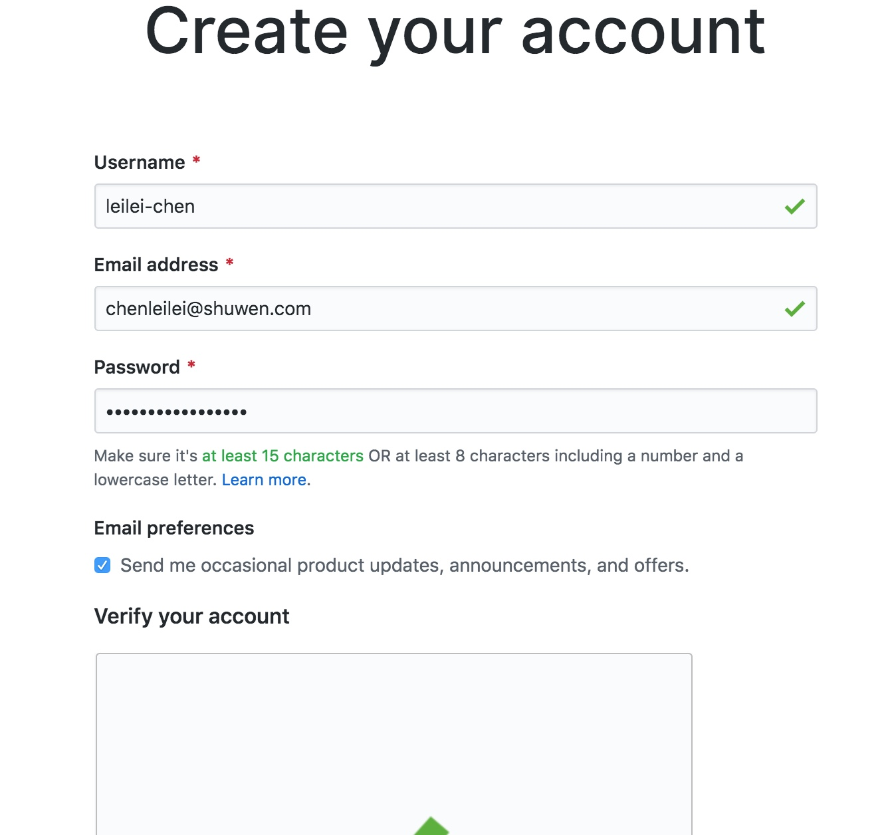

## 背景

相信践行群里的朋友们都知道[笑来](http://lixiaolai.com/#/)老师的[《区块链小白书》](https://blockchainlittlebook.com/#/)，在创作这本书的时候，笑来老师不但把内容、排版都做好了，而且申请了一个网站，将内容发布在这个网站上了。当师娘问笑来老师区块链是什么的时候，笑来老师很帅气地甩出了一个网站，让师娘去吹牛。

当你的老婆问你一个全民关心的问题的时候，你想不想也要这样帅气地甩出一个网站给你老婆去吹牛呢？

如果答案是yes的话，那么请继续下去吧，你会发现创作自己的网站其实很容易。

## 制作网站的最少必要知识

[笑来](http://lixiaolai.com/#/)老师曾经说过：

>  对于任何有技术含量的领域，要想速成那是不可能的，但是可以快速入门.
>
> 要快速入门的关键是要掌握该领域的最少必要知识，即MAKE(Minimal Actionable Knowledge and Experience）。

那制作自己的网站的最少必要知识是什么呢？4个工具
* github
* git
* markdown
* docsify
* 阿里云

我猜，你一看到需要以上五个工具，而且每个工具都很陌生就很恐惧。我也是。**这是对陌生事物的恐惧在作祟。**

作为一个程序员，我一直在用git和github，而平时工作的时候也会用到阿里云，因此对这三个工具很熟悉。但是，之前我也没有用过markdown和docsify，我看到这两个工具也很抵触，不想学，但是想到笑来老师一个会计专业毕业的人都可以学习后自己搭建一个网站，我照猫画虎也应该可以搞出来，于是硬着头皮去学习了这两个工具。

结果很出乎我的意料，学习markdown我只用了半个小时，因为很容易；而docsify经过一天的探索，我发现只需要一两个命令就够了，也非常容易。

于是我总共花费一周末的时间，做了自己的网站，[BOX & 定投践行群全攻略](http://www.regularinvestinginbox.top/#/?id=box-amp-定投践行群全攻略)

## 工具功能简介

1. github
    * github是代码托管工具，就像我们把钱存在银行一样，程序员可以把代码存在github上。我们需要把我们的网站内容上传到这个网站上，由他们给我们托管。
    * **使用github几乎没有什么技术含量。**
2. git
    * Git 是代码版本管理工具，用来将你的网站内容推送到github上进行托管。
    
3. markdown
  
    * 这是一个文档格式生成器，利用它，即使是一个没有任何设计细胞的人（比如我），也可以设计出很好的布局来。
    * 学习这个工具，你还可以体验一把高级编程的经历。
    
4. docsify

    * 这是一个开源网站生成工具，利用它你可以非常容易的将markdown生成的文档转换为网站，

    * 我在学习这个工具之前，就很担心网站到底应该怎么做，是不是要学习html标记语言？是不是需要学习网站制作工具？答案是并不需要，docsify会自动帮你生成网站，你只需要学习docsify的几个命令即可。
5. 阿里云
    * 我们需要从在阿里云上购买域名，有阿里云帮我们解析网站的域名。
    * **使用阿里云几乎没有什么技术含量。**
    * 当然也可以在[name.com](https://www.name.com/)上购买域名，但是稍微贵一些。

## 制作网站流程

首先要说的是，这五个工具虽然都很复杂，但是对于我们制作网站这个任务来说，对于每个工具我们只需要学习其中的几个常用命令就够了，因此学习难度其实并不高。

### 1、github

github就是一个代码管理工具，要想使用它提供的服务，你需要做的就是像其他网站一样，注册并创建你的代码仓库就可以了。**相信群里学习过李骏老师编程课的同学应该都已经创建好账号，并使用过github了。**

1. 注册github账号，[点击进入注册页面](https://github.com/join?source=header-home)。创建账号：
按要求填写Username，Email address和Password，**其中Username申请了就不能修改了，请慎重选择。**

2. 选择计划，按照默认选择Individual，点击Choose Free即可。即选择个人、免费服务模式。

3. 个人情况和兴趣选择，按实际情况填写后点击Complete Setup即可。

4. 你会收到一封验证邮件，进入邮箱，点击Verify email address，进入创建第一个代码库页面，按图示填写内容后，点击Create repository完成代码库的创建。

5. 进入代码库页面，复制代码库地址，操作如下：

6. 利用git将代码库下载到本地，打开terminal，执行git clone命令，其中clone后面的网址即为上一步复制的网址。

